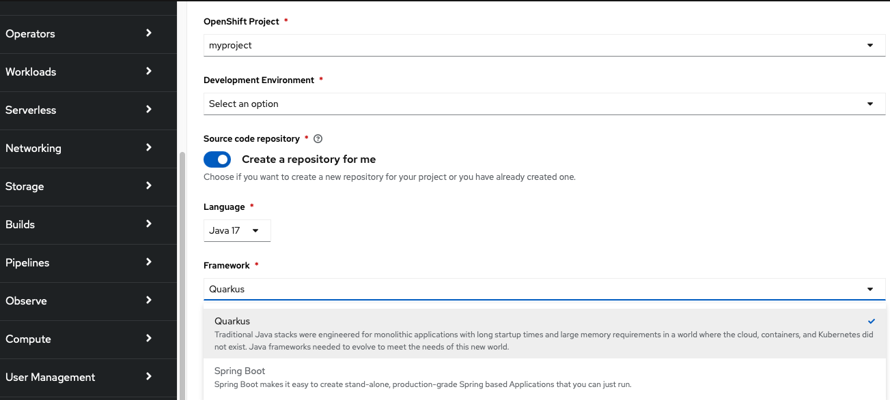
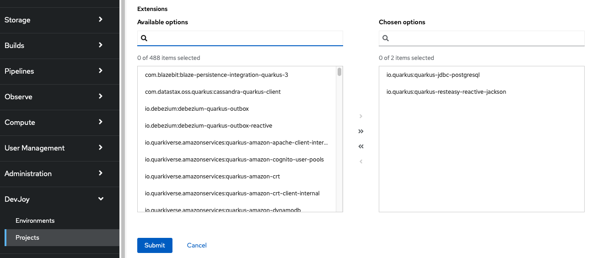

# The Devjoy project
Devjoy is a community project that aims at providing even more developer joy on top of OpenShift. It focuses on the quick creation of development environments and projects. Projects in terms of Devjoy are not equal to the concept of projects in OpenShift. A Devjoy project can be compared to a component/project that you created with your favorite IDE.

Imagine you have a great idea for a new application and have nothing more than an OpenShift cluster with the GitOps and Pipelines operators installed. Devjoy enables you to focus on writing the code for your new project and instantly see the results in your containerized environment. You would not want to care about the underlying infrastructure nor would you care about creating or configuring a development environment for that purpose.
## How is this implemented?
Devjoy provides two operators that extend OpenShift by new abstractions, i.e. custom resource definitions (CRD):

- The Gitea operator implements two features that form the basis for Devjoy. Firstly, it allows the creation of Git servers in OpenShift based on a CRD called 'Gitea'. Secondly, it allows you to create new repositories on the fly using the GiteaRepository CRD. If you want to learn more about the Gitea operator, have a look at the [docs](./operators/gitea/gitea-operator/README.md).
- The Devjoy operator makes use of the Gitea operator to be able to host source code inside OpenShift. It introduces the concept of a DevEnvironment which manages several ingredients such as a Git server, an ArgoCD instance, and several predefined Pipelines to be used by another CRD called Project. A Project relies on a DevEnvironment and creates a new repository, generates the project structure, and pushes the code into that repository. From there, it triggers a pipeline that builds the container image from the source code and pushes it to an image stream. Finally, the code is deployed using a GitOps approach via ArgoCD. You can then check out the repository in your favorite IDE or you can directly use Red Hat OpenShift Dev Spaces, a container-based IDE to start writing your code. More details on how to install and use the operator can be found in the [docs](./operators/devjoy/devjoy-operator/README.md).


## What kind of projects can be generated?
At the moment, only Quarkus projects can be generated. The Project CRD allows to specify the desired extensions to be used. It is planned to support Spring Boot projects soon, too. Furthermore, there will be a console plugin that allows the creation of new projects via the OpenShift console.

## Can you show me an example?

Sure, let us demonstrate a simple example.

### Generating the development environment

After installing the devjoy-operator and the gitea-operator you must first create a DevEnvironment. You can do this by navigating to the Administrator -> Operators -> Installed Operators view and selecting the devjoy-operator. Create a new DevEnvironment as follows (or use oc apply -f devenv.yaml).


```yml
apiVersion: devjoy.io/v1alpha1
kind: DevEnvironment
metadata:
  name: test-env
  namespace: <your-namespace>
spec:
  gitea:
    enabled: true
    managed: true
```

The new DevEnvironment will create the following resources in your project:


### Creating a new project

You can now create a new project as follows:

```yml
apiVersion: devjoy.io/v1alpha1
kind: Project
metadata:
  name: testproj
  namespace: <your-namespace>
spec:
  environmentName: test-env
  environmentNamespace: <your-namespace>
  owner:
    user: testuser
    userEmail: testuser@example.com
  quarkus:
    enabled: true
    extensions:
      - quarkus-resteasy-reactive-jackson
      - quarkus-jdbc-postgresql
```

This will create two Git repositories, one for the source code and one for the deployment of the container running your code will be created:


### Generating, building, and deploying the project

Furthermore, three types of pipelines are run as can be seen in this screenshot:


The init-project-* pipeline generates the Quarkus project and pushes it into the source code repository. The source code repository hosts the Maven project with Quarkus and the specified extensions.


The second pipeline init-deploy-* pipeline generates an ArgoCD application and a Helm template for your project, so it can be deployed into the cluster when the image has been built.


The build is accomplished by the third pipeline build-project-*. It will be triggered via a webhook when the init-project-* run finishes by pushing the project into the source repository. When it is finished you will find a deployment with 1 replica and a route. When you click on the route link you will see the Quarkus ui.


The build pipeline runs whenever you push new code into your repository. But how can you start coding? 

### Writing code 

You can clone the repo and use your favorite IDE. But you can also use the IDE integrated into OpenShift called [OpenShift Dev Spaces](https://developers.redhat.com/products/openshift-dev-spaces/overview). To do this you can pick up the factory URL from the status field of the Project.


If Dev Spaces is installed in your cluster, you can paste the factory URL into your browser. This will cause the Dev Spaces operator to generate a new workspace for you. This workspace contains the source code cloned from the Gitea repository and you can run it via the respective Maven command as can be seen in the next screen:


## How will the console plugin (not yet released) look like?

The console plugin will make it much more comfortable to create new projects, e.g. it will present all available Quarkus extensions to the user. Here is a first draft of the plugin:




